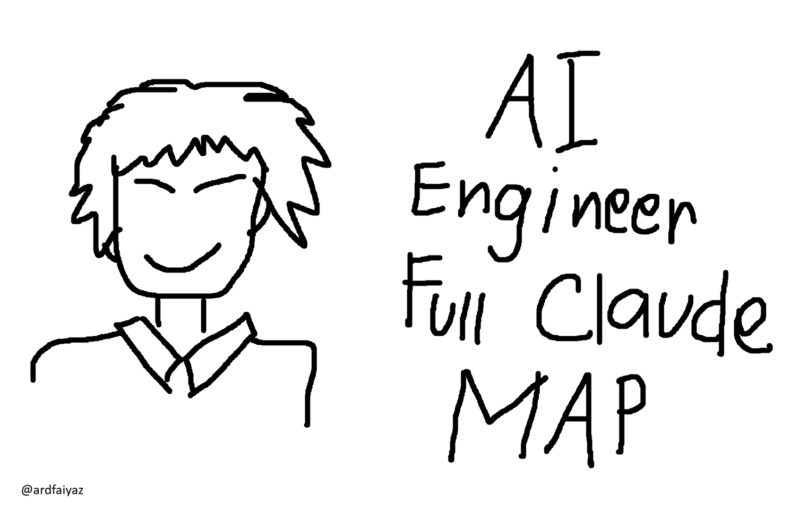

# AI Engineer Full Claude Map ni Ardizuo

**Windows-first, portable Claude Code development setup.** Local-first tools, global developer workflows, orchestration, agents, skills, hooks, MCP integrations, an optional Obsidian knowledge vault, and an optional Claude Map dashboard. **No website is required.**

> **Status: bootstrap preview (not a full release).** This repository currently includes a working, non-destructive base-rule installer, system checker, sanitized inventory exporter, backup/restore utilities, manifests, profiles and documentation. The author's custom assets, third-party provider integrations, and dashboard extension must still be reviewed and packaged. A Full profile is **not yet installable**. Do not claim otherwise.

## Choose your setup route

| Route | Start here | What it does now |
| --- | --- | --- |
| Manual | [Prerequisites](docs/prerequisites.md) | Install requirements, follow integration guides, review each component |
| AI-assisted | [INSTALL_WITH_AI.md](INSTALL_WITH_AI.md) | Give the file to an AI with terminal access, approve each change |
| Local PowerShell | `scripts/doctor.ps1` and `scripts/install.ps1` | Inspect environment; safely install the packaged Core rule only |

### Quick start (Windows PowerShell)

```powershell
cd <path-to-this-repository>
.\scripts\doctor.ps1
.\scripts\install.ps1 -Profile core          # dry run (default)
.\scripts\install.ps1 -Profile core -Apply   # copies one namespaced rule
.\scripts\export-inventory.ps1              # names only; review before sharing
```

If script execution is restricted, review the code and use `powershell.exe -NoProfile -ExecutionPolicy Bypass -File .\scripts\doctor.ps1` **only if you trust the repository**; don't run remote scripts without inspecting them.

### What's included and what's not

- Global workflow concept: **Triage → Contract → Dispatch → Review → Ship**.
- Completion evidence concept: **simplify · code-review · reuse-audit · dead-code-scan · vault-learning**. A command being available is *not* proof it ran.
- Published plans for developer agents, skills, plugin registrations, MCPs, Obsidian templates, and local Claude Map.
- Third-party components are **referenced, not redistributed**. They may need separate installation/authentication and may have their own terms.
- **No credentials, live user settings, session histories or private notes** belong in this repository.
- No social-media tooling or workflows.

## Read next

[Architecture](docs/architecture.md) · [Prerequisites](docs/prerequisites.md) · [Component catalog](docs/components/README.md) · [Release checklist](docs/release-checklist.md) · [Security](SECURITY.md) · [Attribution](THIRD_PARTY_NOTICES.md)

## Licensing

**License selection is pending.** This public repository is not yet an approved open-source release until a license is chosen and original/third-party ownership is audited. A permissive license such as MIT may fit the author's original code, but upstream dependencies retain their own licenses.
